# Generator Tabel pod przekroje

Program składa się z dwóch narzędzi i tak też podzielona jest ta instrukcja:

1. [**Plugin QGIS**](https://github.com/HinoYoseii/line_splitter_plugin) — przygotowuje dane przestrzenne z projektu QGIS i eksportuje je do pliku CSV.
2. [**Aplikacja desktopowa**](https://github.com/HinoYoseii/generator_tabel) — wczytuje plik CSV z danymi z QGIS i generuje gotowe tabele w formacie JPG.

## Spis treści
- [Spis treści](#spis-treści)
- [Część 1 — Plugin QGIS](#część-1--plugin-qgis)
  - [Do czego służy?](#do-czego-służy)
  - [Instalacja pluginu](#instalacja-pluginu)
  - [Jak używać pluginu?](#jak-używać-pluginu)
    - [1. Uruchom plugin](#1-uruchom-plugin)
    - [2. Wybór warstwy linii przekrojów](#2-wybór-warstwy-linii-przekrojów)
    - [3. Wybór warstw poligonowych](#3-wybór-warstw-poligonowych)
    - [4. (Opcjonalne) Tworzenie unikalnej nazwy z id](#4-opcjonalne-tworzenie-unikalnej-nazwy-z-id)
    - [5. Ustawienia eksportu](#5-ustawienia-eksportu)
    - [6. Łączenie warstw](#6-łączenie-warstw)
- [Część 2 — Aplikacja desktopowa](#część-2--aplikacja-desktopowa)
  - [Do czego służy?](#do-czego-służy-1)
  - [Instalacja aplikacji](#instalacja-aplikacji)
  - [Jak używać aplikacji?](#jak-używać-aplikacji)
    - [1. Wybór pliku CSV](#1-wybór-pliku-csv)
    - [2a. Podstawowa konfiguracja](#2a-podstawowa-konfiguracja)
    - [2b. Podstawowa konfiguracja - Presety wierszy](#2b-podstawowa-konfiguracja---presety-wierszy)
    - [3. Mapowanie wierszy](#3-mapowanie-wierszy)
    - [4. Przetwarzanie i eksport](#4-przetwarzanie-i-eksport)

# Część 1 — Plugin QGIS

## Do czego służy?

Plugin pobiera z projektu QGIS warstwy linii (przekrojów) oraz warstwy poligonów (np. warunki geologiczne, hydrologiczne itp.), dzieli linie na odcinki w miejscach granic poligonów, a następnie łączy wyniki i eksportuje je do pliku CSV. Ten plik będzie używany w drugiej części przez aplikację desktopową.

Plugin korzysta głównie z wbudowanych funkcji w Qgis więc wszystkie te kroki tak naprawdę można zrobić ręcznie, ale plugin łączy je w całość.

  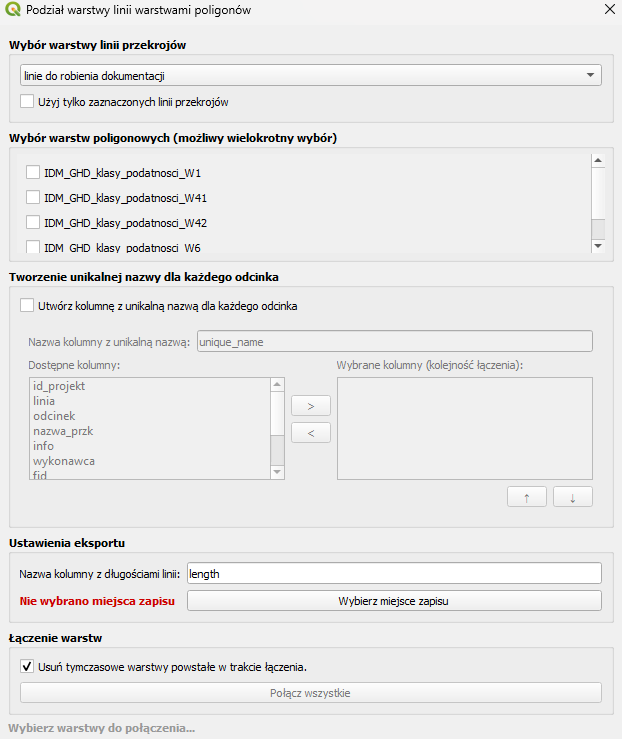

---

## Instalacja pluginu

1. Pobierz najnowszy [release](https://github.com/HinoYoseii/line_splitter_plugin).
2. Uruchom **QGIS**.
3. Wejdź w menu **Wtyczki → Zarządzanie wtyczkami**.
4. W otwartym oknie wybierz opcję **Instaluj z pliku ZIP** i wskaż pobrany plik <code style="background:#EFF1F3; padding: 3px 2px; border-radius:7px; color:#1F2328; font-weight:400">line_splitter_plugin.zip</code>.
5. Po instalacji powinna pojawić się nowa ikona na pasku narzędzi:  oraz opcja w menu **Wektor → Line Splitter → Przygotowanie danych do generacji tabel pod przekroje**.

  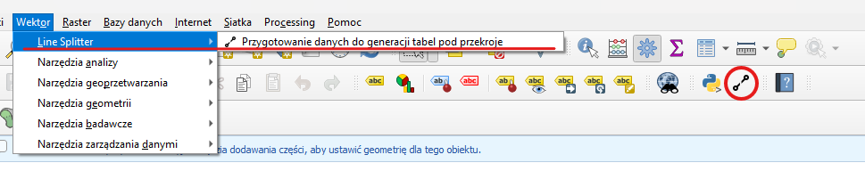

<strong>INFO:</strong> Jeżeli po instalacji ikona pluginu się nie wyświetla, kliknij prawym przyciskiem myszy na pasek narzędzi i zaznacz opcję .

---

## Jak używać pluginu?

<strong>UWAGA:</strong> W tej cześci niezbędne są:
<ul>
  <li>Warstwa Shapefile o typie geometrii 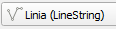</img> z liniami przekrojów.</li>
  <li>Przynajmniej jedna warstwa Shapefile o typie geometrii 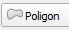</img> z atrybutami, które mają się znaleźć w tabelkach.</li>
</ul>

### 1. Uruchom plugin

Będąc w wybranym projekcie kliknij ikonę pluginu na pasku narzędzi  lub wybierz opcję w menu **Wektor → Line Splitter → Przygotowanie danych do generacji tabel pod przekroje**.

### 2. Wybór warstwy linii przekrojów

<strong>UWAGA:</strong> Konieczne jest żeby przekroje miały chociaż jedną kolumnę z unikalnymi wartościami! Będzie to kolumna używana do identyfikacji przekrojów i nazywania eksportowanych tabelek w drugiej części.

  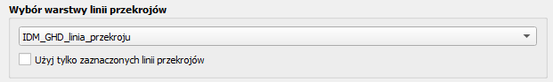

Wybierz warstwę linii z przekrojami, dla których chcesz wygenerować tabelki.

Jeżeli chcesz wygenerować tabelki tylko dla **wybranych przekrojów** z warstwy, zaznacz je najpierw w QGIS, a następnie zaznacz opcję <code style="background:#EFF1F3; padding: 3px 2px; border-radius:7px; color:#1F2328; font-weight:400">Użyj tylko zaznaczonych linii przekrojów</code>.

  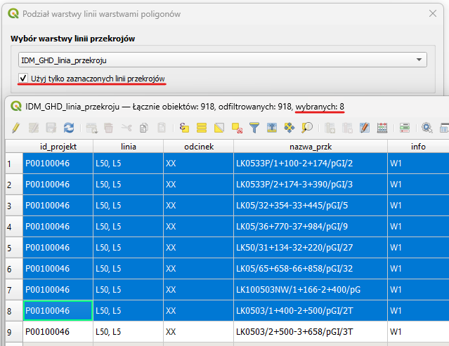

### 3. Wybór warstw poligonowych

Wybierz **jedną lub więcej warstw poligonów**, które opisują obszary wzdłuż wybranych linii przekrojów.

  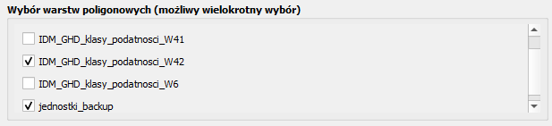

<strong>UWAGA:</strong> Warstwy poligonów muszą mieć poprawną geometrię. Sprawdź poprawność geometrii za pomocą opcji w menu <strong>Wektor → Narzędzia geometrii → Sprawdź poprawność...</strong>

### 4. (Opcjonalne) Tworzenie unikalnej nazwy z id

<strong>UWAGA:</strong> Ten krok jest potrzebny tylko wtedy, gdy warstwa linii nie posiada kolumny z unikalnymi nazwami. Jeżeli każda linia ma już unikalną nazwę możesz przejść od razu do kroku 5. 

Plugin pozwala na stworzenie kolumny łączącej wartości z wybranych kolumn w ustalonej kolejności.

Można wybrać jakie kolumny mają się zawierać w nazwie. Do nazwy zostanie dodane unikalne id wiersza, dzięki temu nazwa zawsze będzie unikalna, nawet jeżeli wybrana kombinacja kolumn zawiera duplikaty.

  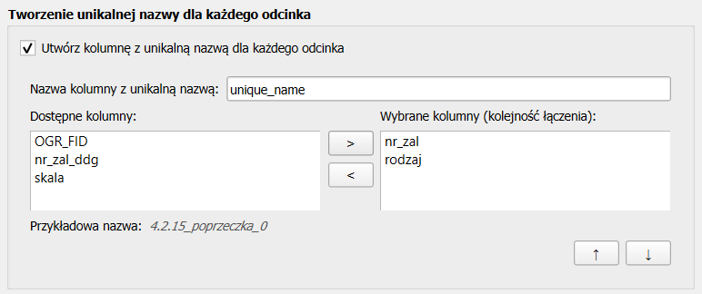

<strong>INFO:</strong> Utworzona kolumna będzie dodana tylko do eksportowanego pliku CSV. Oryginalna warstwa w projekcie pozostanie niezmieniona. 

### 5. Ustawienia eksportu

  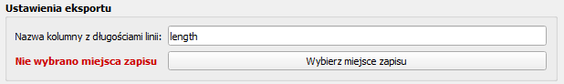

Kolumna z długościami linii jest generowana automatycznie przy przetwarzaniu danych. Jest niezbędna do generowania tabel w drugiej części. Domyślnie ma nazwę <code style="background:#EFF1F3; padding: 3px 2px; border-radius:7px; color:#1F2328; font-weight:400">length</code>, ale można ją dowolnie zmieniać dopóki nie pokrywa się z nazwą innej kolumny.

Miejsce zapisu i nazwa pliku muszą być zdefiniowane ręcznie. Upewnij się, że masz uprawnienia do zapisu w wybranym folderze.

### 6. Łączenie warstw

  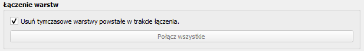

Kliknij przycisk <code style="background:#EFF1F3; padding: 3px 2px; border-radius:7px; color:#1F2328; font-weight:400">Połącz wszystkie</code>. Plugin wykona automatycznie następujące operacje:

1. Sprawdzi poprawność geometrii warstw poligonowych (jeśli znajdzie błędy, doda do projektu warstwy z zaznaczonymi problemami).
2. Połączy wybrane warstwy poligonowe w jedną.
3. Wybierze wszystkie zaznaczone linie.
4. Doda kolumnę z unikalną nazwą.
5. Podzieli linie na odcinki w miejscach granic poligonów.
6. Dołączy atrybuty z warstw poligonowych do każdego odcinka na podstawie lokalizacji.
7. Obliczy długości odcinków.
8. Wyeksportuje wynik do pliku CSV.

<strong>INFO:</strong> Plugin tworzy w projekcie tymczasowe warstwy pomocnicze (np. lines_split, lines_with_length). Zostaną one automatycznie usunięte po zakończeniu pracy. Jeśli chcesz je zachować, odznacz opcję <code style="background:#EFF1F3; padding: 3px 2px; border-radius:7px; color:#1F2328; font-weight:400">Usuń tymczasowe warstwy powstałe w trakcie łączenia</code>.

 

# Część 2 — Aplikacja desktopowa

## Do czego służy?

Aplikacja wczytuje plik CSV przygotowany przez plugin QGIS i generuje graficzne tabele pod przekroje — po jednej tabeli na każdy przekrój. Tabele zapisywane są jako pliki JPG w folderze <code style="background:#EFF1F3; padding: 3px 2px; border-radius:7px; color:#1F2328; font-weight:400">tabele</code>.

  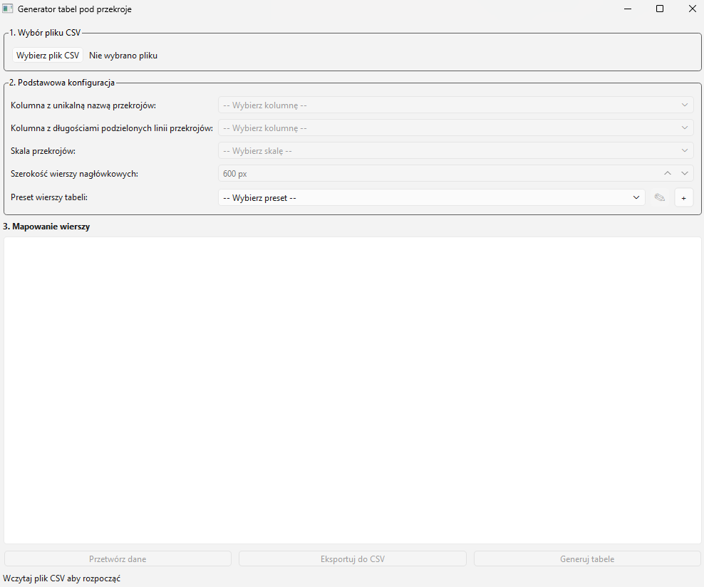

---

## Instalacja aplikacji

1. Skopiuj plik <code style="background:#EFF1F3; padding: 3px 2px; border-radius:7px; color:#1F2328; font-weight:400">GeneratorTabel.zip</code> (którakolwiek wersja tam jest) z NASGT <code style="background:#EFF1F3; padding: 3px 2px; border-radius:7px; color:#1F2328; font-weight:400">\\NASGT\Serwer GT\Pracownicy\Sylwia Leśniak\Generowanie tabel pliki z instrukcją</code>.
2. Rozpakuj plik w dowolnym miejscu na komputerze.
3. Aby uruchomić aplikacje kliknij dwukrotnie na plik <code style="background:#EFF1F3; padding: 3px 2px; border-radius:7px; color:#1F2328; font-weight:400">GeneratorTabel.exe</code>.

<strong>INFO:</strong> Pierwsze uruchomienie może potrwać kilkanaście sekund dłużej, trzeba być cierpliwym.

---

## Jak używać aplikacji?

<strong>UWAGA:</strong> W tej cześci niezbędny jest plik CSV wyeksportowany w części pierwszej.

### 1. Wybór pliku CSV

Kliknij przycisk <code style="background:#EFF1F3; padding: 3px 2px; border-radius:7px; color:#1F2328; font-weight:400">Wybierz plik CSV</code> i wskaż plik wyeksportowany przez plugin QGIS. Po wczytaniu pliku program wyświetli jego nazwę i odblokuje dalsze opcje.

  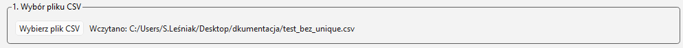

### 2a. Podstawowa konfiguracja

Uzupełnij wszystkie pola wybranymi kolumnami/wartościami.

| Pole | Opis |
|------|------|
| <code style="background:#EFF1F3; padding: 3px 2px; border-radius:7px; color:#1F2328; font-weight:400">Kolumna z unikalną nazwą przekrojów</code> | Kolumna identyfikująca każdy przekrój np. <code style="background:#EFF1F3; padding: 3px 2px; border-radius:7px; color:#1F2328; font-weight:400">nr_zal</code>, <code style="background:#EFF1F3; padding: 3px 2px; border-radius:7px; color:#1F2328; font-weight:400">nazwa_przk</code> albo dodatkowo utworzona przez plugin kolumna <code style="background:#EFF1F3; padding: 3px 2px; border-radius:7px; color:#1F2328; font-weight:400">uniqie_name</code>. Każda unikalna wartość tej kolumny stanie się oddzielną tabelą. |
| <code style="background:#EFF1F3; padding: 3px 2px; border-radius:7px; color:#1F2328; font-weight:400">Kolumna z długościami</code> | Kolumna zawierająca długości odcinków. Domyślnie w pluginie QGIS eksportowana jako <code style="background:#EFF1F3; padding: 3px 2px; border-radius:7px; color:#1F2328; font-weight:400">length</code>. |
| <code style="background:#EFF1F3; padding: 3px 2px; border-radius:7px; color:#1F2328; font-weight:400">Skala przekrojów</code> | Wybierz skalę z listy (np. 1:1000) lub wskaż kolumnę zawierającą wartości skali. Kolumna ze skalą musi zawierać tylko liczby całkowite, np. 1000 odpowiada skali 1:1000, 2500 odpowiada skali 1:2500. Wybranie skali przez kolumnę pozwala na generowanie przekrojów o różnych skalach za jednym razem.|
| <code style="background:#EFF1F3; padding: 3px 2px; border-radius:7px; color:#1F2328; font-weight:400">Szerokość wierszy nagłówkowych</code> | Szerokość etykiet nagłówkowych (po lewej stronie tabeli) w pikselach. Domyślnie 600 px — zwiększ, jeśli nazwy wierszy z presetu są długie. |

### 2b. Podstawowa konfiguracja - Presety wierszy

Preset to zapisana lista wierszy, jakie pojawią się w tabeli (np. preset HYDRO: „Klasy podatności", „Jednostki hydrogeologiczne"). To co jest zapisane będzie się wyświetlało z lewej strony tabeli. 

**Wybór presetu:**
Kliknij listę rozwijaną i wybierz jeden z dostępnych presetów (np. DBP, DGI, HYDRO).

**Tworzenie nowego presetu:**
Kliknij przycisk <code style="background:#EFF1F3; padding: 3px 2px; border-radius:7px; color:#1F2328; font-weight:400">+</code> obok listy presetów. W oknie edytora:
1. Wpisz nazwę presetu.
2. Kliknij <code style="background:#EFF1F3; padding: 3px 2px; border-radius:7px; color:#1F2328; font-weight:400">+ Dodaj wiersz</code> i wpisz nazwy kolejnych wierszy tabeli.
3. Kliknij <code style="background:#EFF1F3; padding: 3px 2px; border-radius:7px; color:#1F2328; font-weight:400">Zapisz</code>.

**Edycja presetu:**
Wybierz preset z listy, a następnie kliknij przycisk z ikoną ołówka <code style="background:#EFF1F3; padding: 3px 2px; border-radius:7px; color:#1F2328; font-weight:400">✎</code>. Możesz zmieniać nazwy wierszy lub dodawać nowe. W oknie edytora dostępny jest też przycisk <code style="background:#EFF1F3; padding: 3px 2px; border-radius:7px; color:#1F2328; font-weight:400">Usuń preset</code>, jeśli chcesz go trwale usunąć.

W oknie edycji presetów można też edytować/dodawać globalne style presetów. Jeżeli w pliku wejściowym CSV znajdzie się jedna z dodanych tu wartości to w tabeli komórka zawierająca tą wartość zostanie wygenerowana z wybranym stylem (kolorem czcionki i tła).

Kliknij jeden z przycisków koło wprowadzonej wartości aby zmienić dla niej kolor czcionki lub tła.

  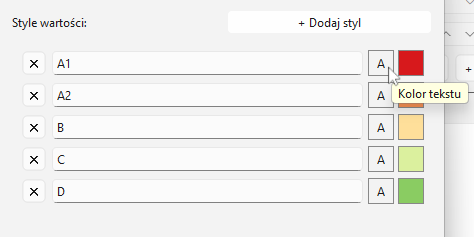

Wybierz kolor ręcznie lub wpisując konkretne wartości.

  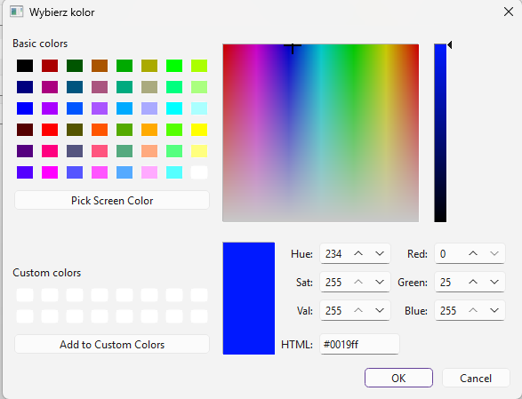

Po kliknięciu przycisku <code style="background:#EFF1F3; padding: 3px 2px; border-radius:7px; color:#1F2328; font-weight:400">OK</code> kolory na podglądzie się zaktualizują.

  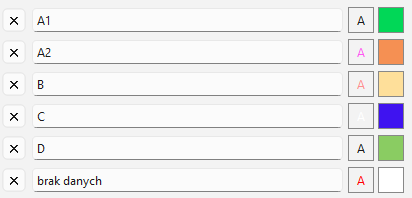

Wygenerowana tabela będzie stylowana wartoścami z presetu.

  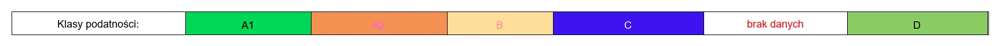

<strong>INFO:</strong> Presety są zapisywane w pliku <code style="background:#EFF1F3; padding: 3px 2px; border-radius:7px; color:#1F2328; font-weight:400">data/PRESETS.json</code> Usunięcie pliku spowoduje, że przy następnym uruchomieniu zostanie on wygenerowany z domyślnymi presetami "DBP", "DGI", "HYDRO".

### 3. Mapowanie wierszy

W sekcji <code style="background:#EFF1F3; padding: 3px 2px; border-radius:7px; color:#1F2328; font-weight:400">Mapowanie wierszy</code> pojawi się lista wierszy dostępnych w wybranym presecie. Dla każdego wiersza tabeli musisz wskazać, skąd ma być pobrana wartość:

- **Kolumna** (domyślnie) — wybierz kolumnę z pliku CSV, której wartości mają wypełniać ten wiersz tabeli.
- **Stała wartość** — kliknij przycisk <code style="background:#EFF1F3; padding: 3px 2px; border-radius:7px; color:#1F2328; font-weight:400">Stała wartość</code> i wpisz tekst, który ma pojawić się w tym wierszu dla każdej tabelki na całej jej długości (przydatne np. przy określaniu charakterystyki drogi).
- **Pomiń** (lub pusta wartość) — jeśli dla danego wiersza nie wybrano ani kolumny, ani stałej wartości, wiersz zostanie pominięty w tabelach.

  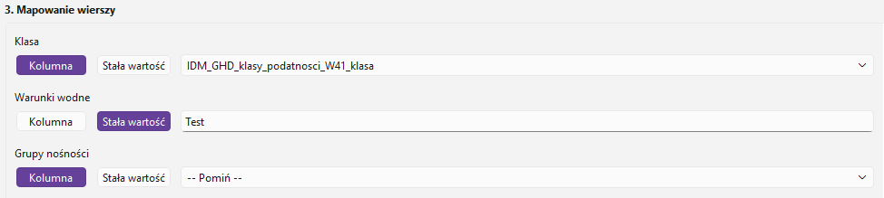

### 4. Przetwarzanie i eksport

Po skonfigurowaniu wszystkich opcji dostępne są trzy przyciski:

**<code style="background:#EFF1F3; padding: 3px 2px; border-radius:7px; color:#1F2328; font-weight:400">Przetwórz dane</code>** — przetwarza wczytany plik CSV zgodnie z ustawieniami. Łączy kolejne odcinki o tej samej wartości w jeden segment. Przycisk jest aktywny dopiero po wypełnieniu wszystkich wymaganych pól w kroku 2.

**<code style="background:#EFF1F3; padding: 3px 2px; border-radius:7px; color:#1F2328; font-weight:400">Eksportuj do CSV</code>** *(dostępny po przetworzeniu)* — zapisuje przetworzone dane do pliku CSV. Przydatne do podglądu lub debugowania. Przy samej generacji tabel można ten krok pominąć.

**<code style="background:#EFF1F3; padding: 3px 2px; border-radius:7px; color:#1F2328; font-weight:400">Generuj tabele</code>** *(dostępny po przetworzeniu)* — generuje graficzne tabele JPG dla każdej linii w pliku i zapisuje je w folderze <code style="background:#EFF1F3; padding: 3px 2px; border-radius:7px; color:#1F2328; font-weight:400">tabele</code> (folder tworzony w tym samym folderze co plik exe aplikacji). Na końcu wyświetla komunikat z liczbą wygenerowanych plików.